# Inhaltsverzeichnis

 * [__Starten der Anwendung__](#starten-der-anwendung)
 * [__Erfassung der Verkäufer__](#erfassung-der-verkufer)  
     * [Hinzufügen eines neuen Verkäufers](#hinzufgen-eines-neuen-verkufers)
	* [Hinzufügen einer Verkäufernummer](#hinzufgen-einer-verkufernummer)
	* [Entfernen einer Verkäufernummer](#entfernen-einer-verkufernummer)        
	* [Import und Export von Kundendaten](#import-und-export-von-kundendaten)
	* [Bearbeiten eines Verkäufers](#bearbeiten-eines-verkufers)
* [__Erfassung der Artikel__](#erfassung-der-artikel) 
	* [Hinzufügen eines Artikels](#hinzufgen-eines-artikels)
	* [Import und Export von Artikeln](#import-und-export-von-artikeln) 
	* [Sortieren und Filtern](#sortieren-und-filtern)
* [__Abrechnung__](#abrechnung)
	* [Abrechnungen drucken](#abrechnungen-drucken)
	* [Alle Abrechnungen drucken](#alle-abrechnungen-drucken) 
	* [Interne Abrechnung drucken](#interne-abrechnung-drucken)
* [__Info__](#info)
* [__Shortcuts__](#shortcuts)

###Erfassung der Verk&auml;ufer

Um in die Verkäufer Erfassung zu gelangen benötigt es einen Klick auf „Verkäufer“. Wird die Anwendung gestartet ist diese Maske bereits geöffnet.
Alternativ kann man auch Strg + 1 (Steuerungstaste gedrückt halten und dann die 1 drücken) um in die Verkäufer Ansicht zu gelangen.

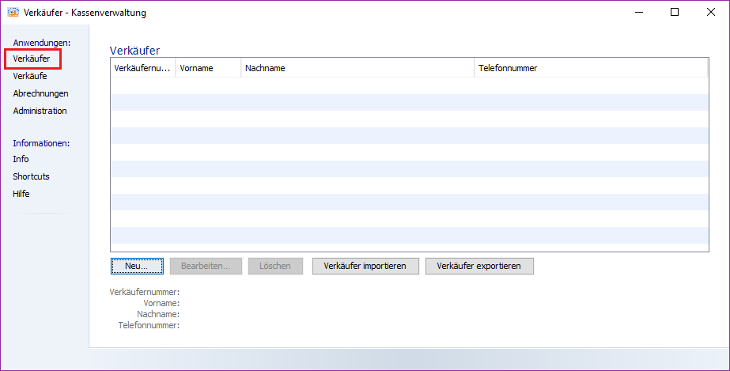

###Hinzuf&uuml;gen eines neuen Verk&auml;ufers

Die Erfassung der Kundendaten erfolgt mit einem Klick auf den Neu-Button in der Verkäuferansicht. 
Es öffnet sich ein neues Fenster.

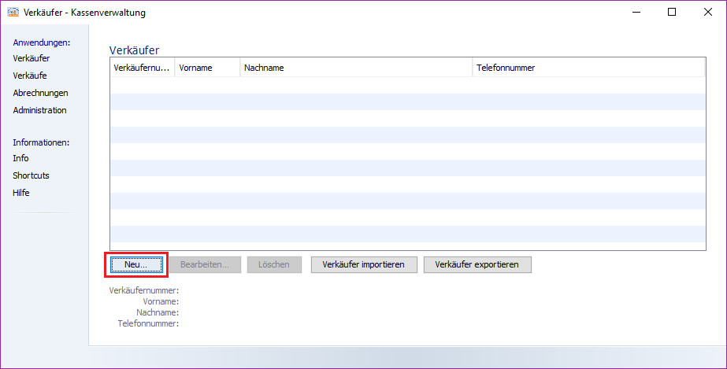

###Hinzuf&uuml;gen einer Verk&auml;ufernummer

Der Hinzufügen Button ermöglicht es, dem Verkäufer eine neue Verkäufernummer hinzuzufügen.
Alternativ kann man hier auch die Enter Taste drücken um die Nummer einzutragen.
Hier zuerst im Feld „Verkäufernummer“ die jeweilige Nummer eintragen.

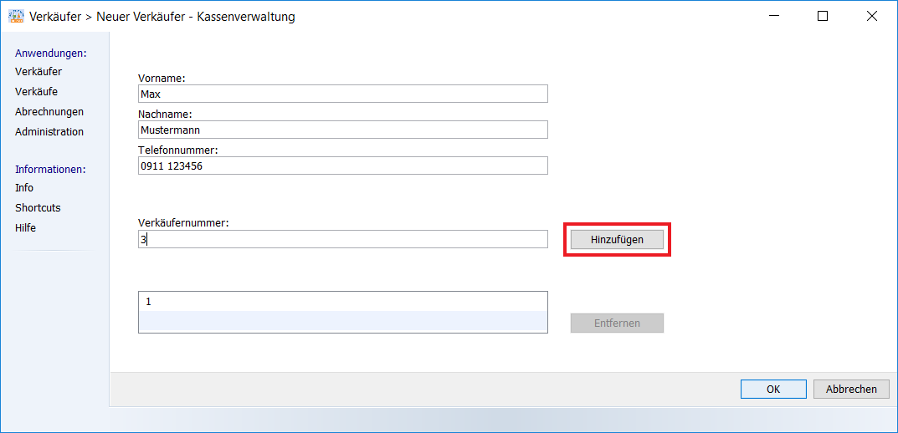

Mit Klick auf „OK“ wird der Verkäufer angelegt und die Maske schließt sich.
Alternativ kann man hierzu wenn man sich in keinem Eingabefeld befindet und keinen Eintrag in der Liste markiert hat
die Enter Taste drücken um die Maske zu schließen.

###Entfernen einer Verk&auml;ufernummer

Um von einem Verkäufer eine Verkäufernummer zu entfernen, benötigt es einen Klick auf die jeweilige Nummer.
Der „Entfernen“ Button wird aktiviert und mit Klick auf den Button wird die Nummer entfernt.

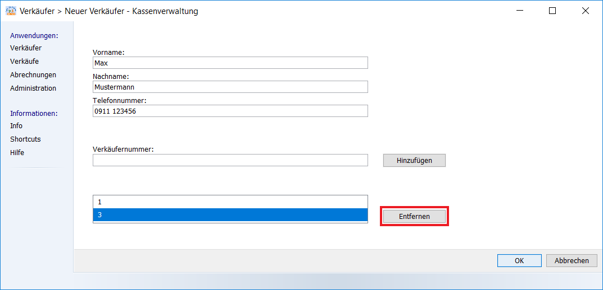

###Import und Export von Kundendaten

Um bereits erfasste Verkäufer von einem PC zu einem anderen PC zu übertragen kann man die Export-Funktion nutzen.
Die Verkäufer werden in einer Datei zusammengefasst und diese Datei am ausgewählten Ort gespeichert.

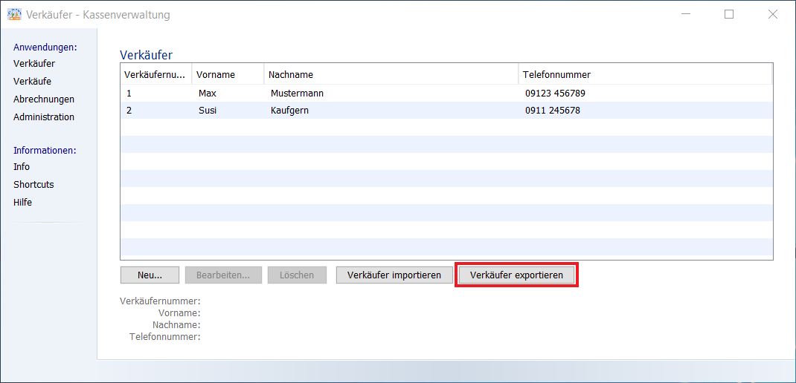

Es öffnet sich folgendes Fenster.

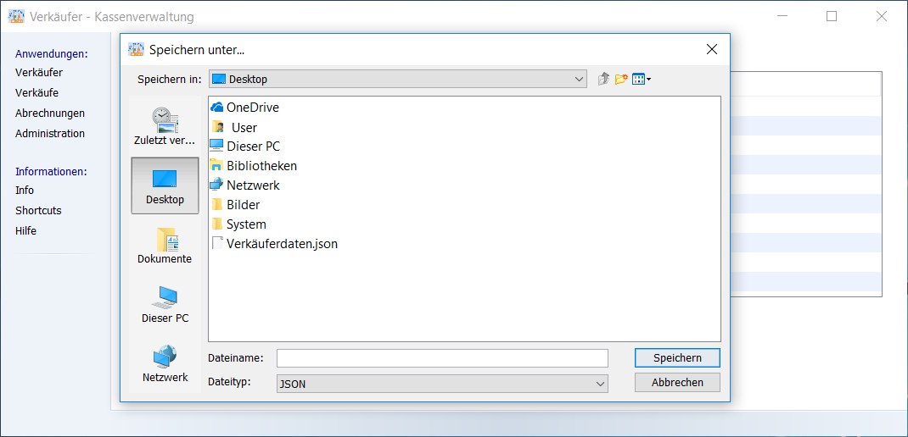

Nun gibt man seinen Dateinamen ein, wählt den Speicherort aus und bestätigt alles mit Klick auf „Speichern“.
Am Speicherort befindet sich nun eine "Dateiname.JSON" Datei mit allen vorhandenen Verkäufern.
Diese Datei kann nun auf einen USB Stick gespeichert werden und an andere PC's gesteckt werden.

Um die vorher exportierten Verkäufer auf einen anderen PC zu übertragen kann hier die Import-Funktion genutzt werden.

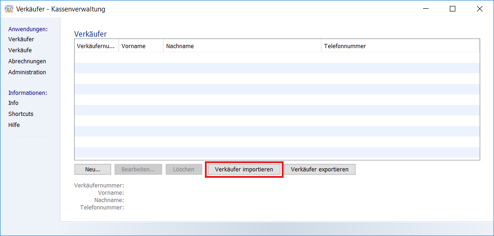

Es öffnet sich folgendes Fenster

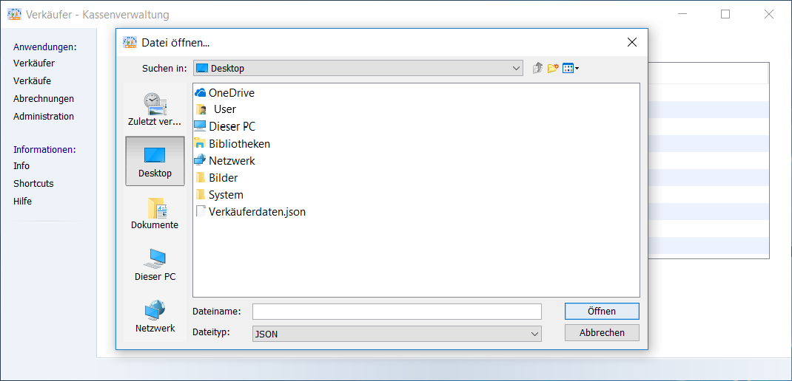

Hier sucht man auf dem USB Stick nach der vorher gespeicherten "Dateiname.JSON" Datei.
Klicken Sie auf die Datei und anschließend auf Öffnen 

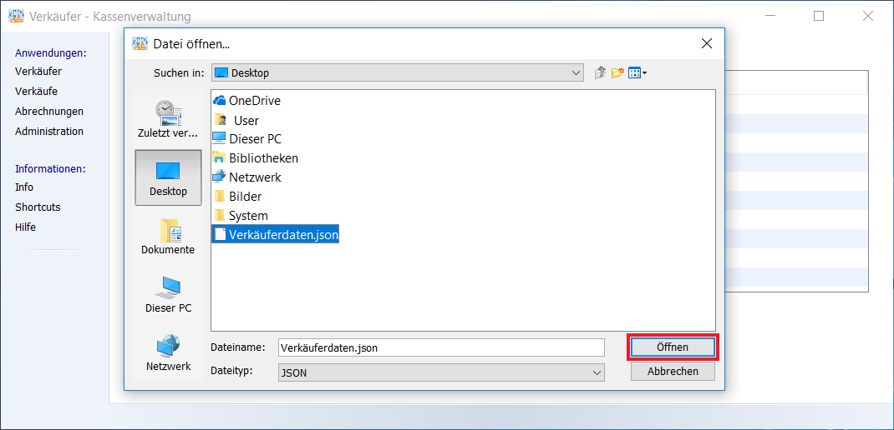

Die Daten werden importiert und die Verkäuferliste wird aufgefüllt.
Der Benutzer erhält eine Benachrichtigung wenn alles geklappt hat.
Falls etwas schief läuft wird auch hier eine Benachrichtigung ausgegeben, beispielsweise wenn ein Eintrag doppelt vorhanden ist.
Wie hiermit umzugehen ist wird genauer in der Howto Anleitung erklärt

###Bearbeiten eines Verk&auml;ufers

Um einen bereits vorhanden Verkäufer zu bearbeiten, klickt man diesen an und klickt auf den Button „Bearbeiten“.

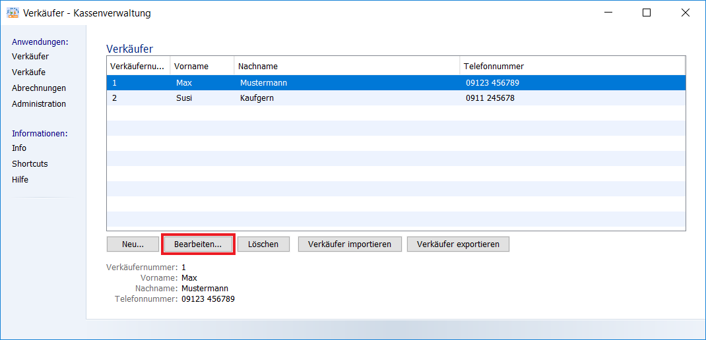

Es öffnet sich die Maske der "Neu Erfassung".

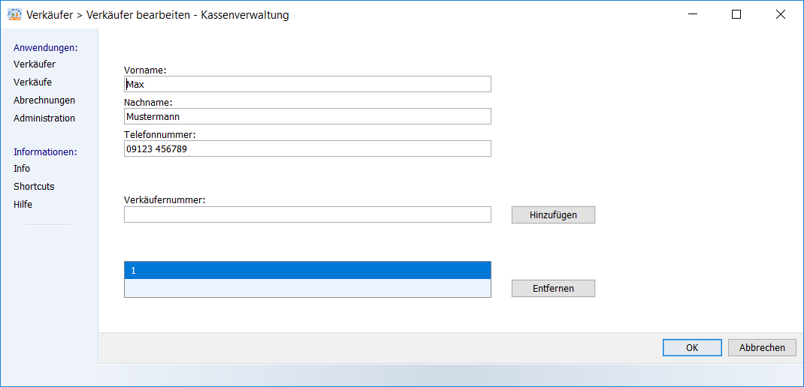

In dieser Maske besteht nun die Möglichkeit, den Namen, die Telefonnummer und die Verkäufernummern abzuändern oder zu ergänzen.

###Erfassung der Artikel

Um in die Artikelerfassung zu gelangen, benötigt es einen Klick auf "Verkäufe".
Alternativ kann man auch Strg + 2 (Steuerungstaste gedrückt halten und dann die 2 drücken) um in die Verkäufe Ansicht zu gelangen.

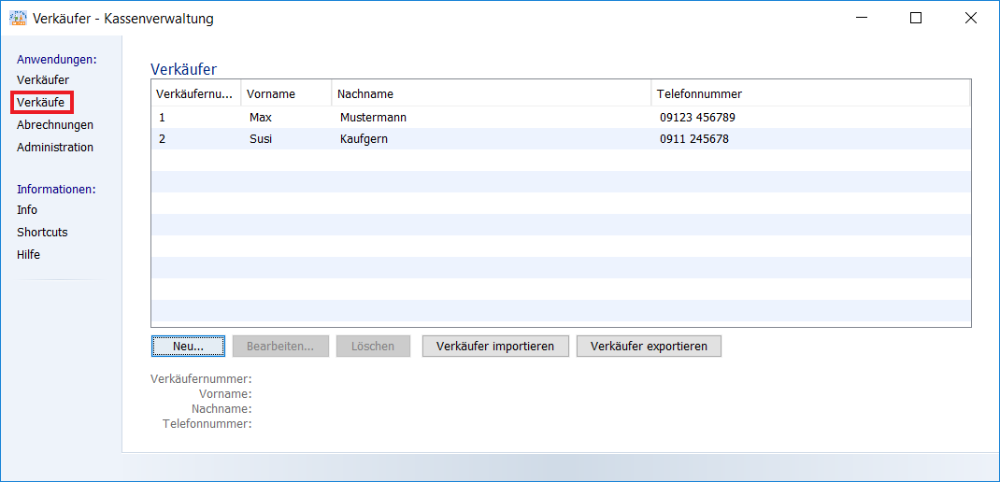

###Hinzuf&uuml;gen eines Artikels

Mit Klick auf „Neu“ öffnet sich eine neue Maske. 

Hier trägt man nun die Daten des jeweiligen Verkaufes ein.
Mit der Tabulator Taste (Die Taste links von Q mit den 2 Pfeilen) ist es hier möglich schneller in das nächste Feld zu wechseln.

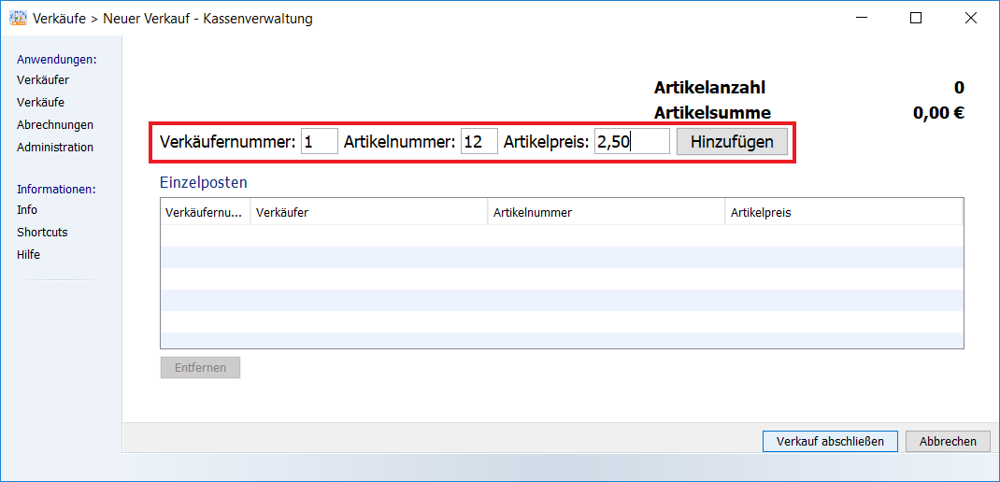

Um den Verkauf abzuschließen benötigt es nur einen Klick auf „Verkauf abschließen“.
Alternativ kann man hier die Enter Taste drücken wenn man sich in keinem Eingabefeld befindet um den Verkauf abzuschließen

 **!Wichtig! klicken Sie erst auf Verkauf abschließen, wenn der Kunde gezahlt hat. 
Erst nachdem Sie auf Verkauf abschließen klicken werden Ihre Einträge gespeichert. Wenn Sie zwischendrin auf abbrechen klicken 
sind Ihre Einträge verworfen!**

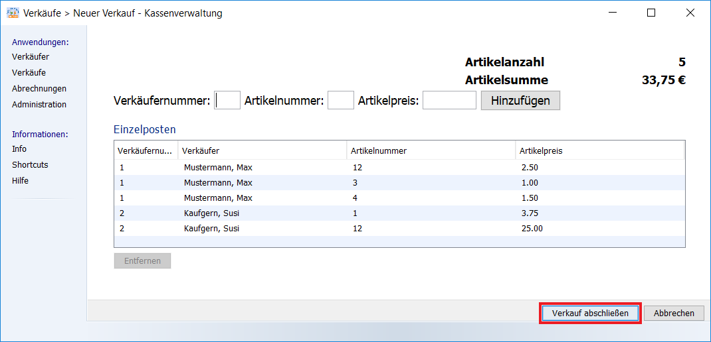

Ein Artikel kann entweder bei der Erfassung, oder im Nachhinein entfernt werden. Hierzu den jeweiligen Artikel anklicken und auf den „Entfernen“ Button Klicken.

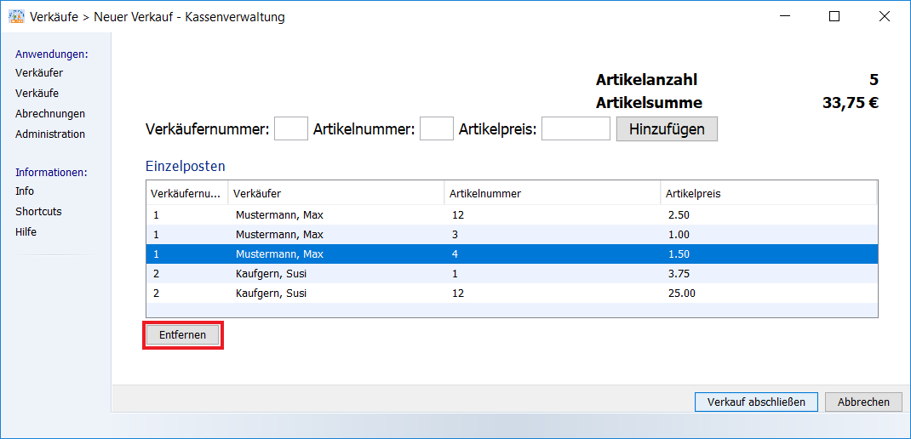

Bevor der Artikel entfernt wird, fragt das Programm den Benutzer ob er diesen Artikel wirklich löschen möchte. Hier mit „Ja“ (der Artikel wird gelöscht) oder „Nein“ (der Artikel bleibt vorhanden) bestätigen.

###Import und Export von Artikeln

Ähnlich wie beim Import und Export von Verkäufern kann man auch Artikel importieren und exportieren

Um bereits erfasste Verkäufe von einem PC zu einem anderen PC zu übertragen kann man die Export-Funktion nutzen.
Die Verkäufe werden in einer Datei zusammengefasst und diese Datei am ausgewählten Ort gespeichert.

Mit einem Klick auf „Verkäufe Exportieren“ öffnet sich ein neues Fenster. 

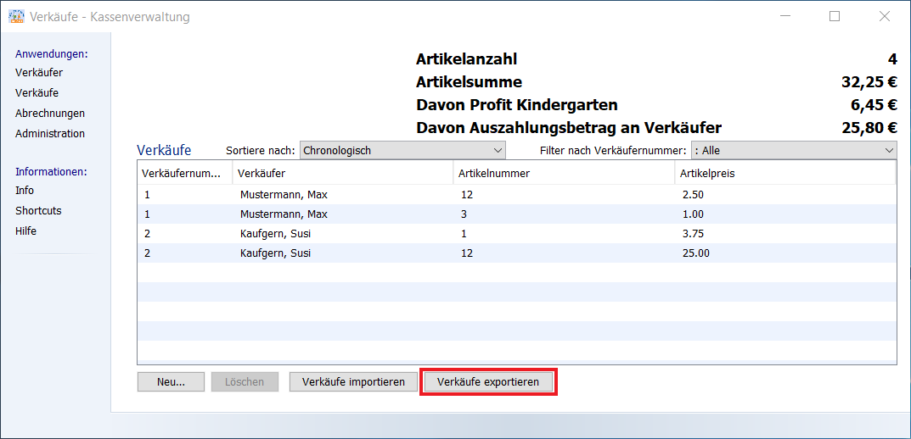

In diesem Fenster wählt man wieder den Speicherort aus, gibt der Datei einen Namen und schließt den Vorgang mit einem Klick auf „Speichern“ ab.

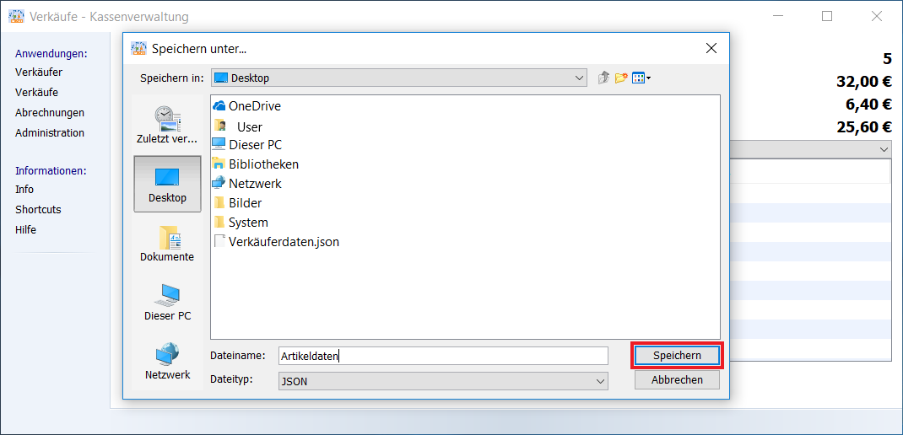

Nun gibt man seinen Dateinamen ein, wählt den Speicherort aus und bestätigt alles mit Klick auf „Speichern“.
Am Speicherort befindet sich nun eine "Dateiname.JSON" Datei mit allen vorhandenen Artikeln.
Diese Datei kann nun auf einen USB Stick gespeichert werden und an andere PC's gesteckt werden.

Um die vorher exportierten Verkäufe auf einen anderen PC zu übertragen kann hier die Import-Funktion genutzt werden.

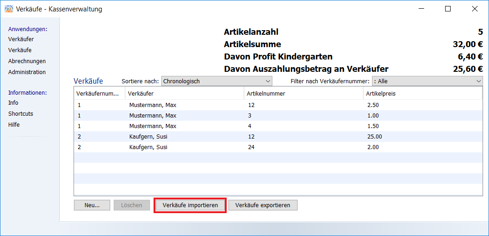

Es öffnet sich ein neues Fenster um die Datei auszuwählen.

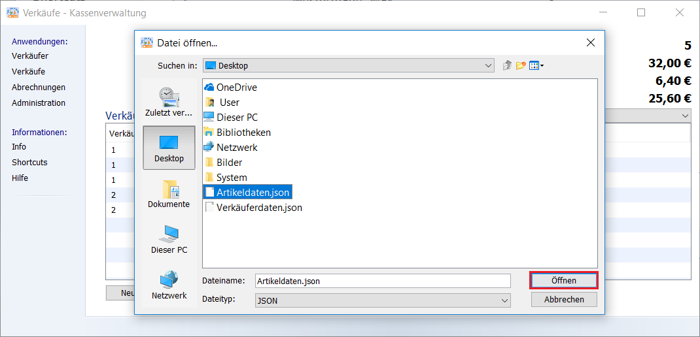

Nachdem an die passende Stelle navigiert wurde und die zu importierende Datei ausgewählt ist beendet man den Vorgang mit einem Klick auf „Öffnen“.
Die Daten werden importiert und die Artikelliste wird aufgefüllt.
Der Benutzer erhält eine Benachrichtigung wenn alles geklappt hat.
Falls etwas schief läuft wird auch hier eine Benachrichtigung ausgegeben, beispielsweise wenn ein Eintrag doppelt vorhanden ist.
Wie hiermit umzugehen ist wird genauer in der Howto Anleitung erklärt.

Mit Klick auf „Verkäufe Importieren“ öffnet sich ein neues Fenster. 

Es öffnet sich ein neues Fenster um die Datei auszuwählen.

Nachdem an die passende Stelle navigiert wurde und die zu importierende Datei ausgewählt ist, beendet man den Vorgang mit einem Klick auf „Öffnen“.
Der Vorgang wird beendet und die Datensätze werden in der Artikelerfassung hinzugefügt.

###Sortieren und Filtern

Die Verkäufe Ansicht verfügt zusätzlich über eine Sortier - und Filterfunktion.
Man hat die Möglichkeit die Liste zu Sortieren um sich einen besseren Überblick zu verschaffen.
Wenn nach "Chronologisch" sortiert wird, werden die Artikel in der Reihenfolge angeordnet in der sie verkauft wurden
mit zuerst verkauften Artikel ganz oben stehend.

Bei "Nach Verkäufer und Verkäufernummer" sortieren, werden die Verkäufer erst alphabetisch
und dann nach der Verkäufernummer aufsteigend sortiert.

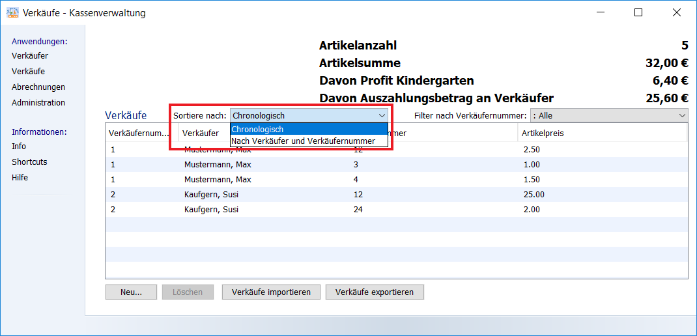

Sollte man nur die Informationen über einen einzelnen Verkäufer brauchen,
falls zum Beispiel ein Verkäufer wissen will, welche und wie viele Artikel er bisher verkauft hat
kann man bei dem Dropdown-Menü "Filter nach Verkäufernummer" den gewünschten Verkäufer oder seine Verkäufernummer heraussuchen.
Dabei wird in der Liste nur noch dieser Verkäufer gelistet mit seinen bisher verkauften Artikeln.
Um das wieder rückgängig zu machen, muss in dem Dropdown-Menü nur der oberste Punkt "Alle" ausgewählt werden.

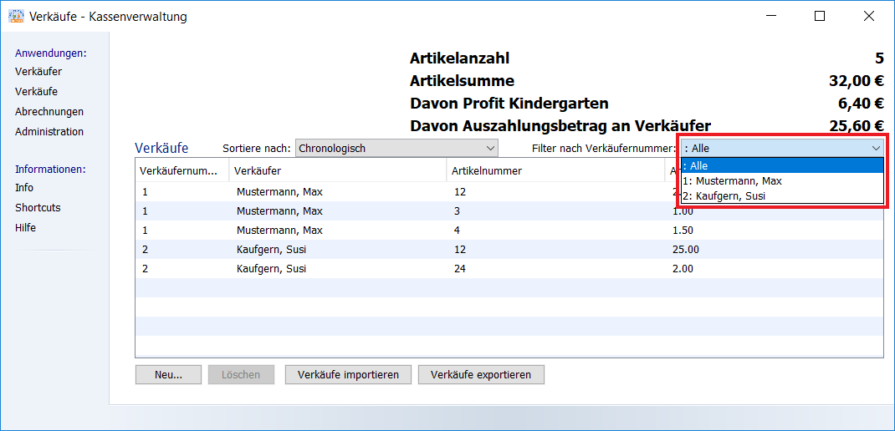

###Abrechnung

Um in die Abrechnung zu gelangen, benötigt es einen Klick auf „Abrechnung“.
Alternativ kann man auch Strg + 3 (Steuerungstaste gedrückt halten und dann die 3 drücken) um in die Abrechnung Ansicht zu gelangen.

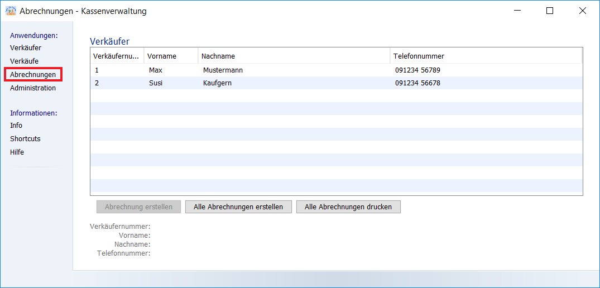

Hier werden in einer Tabelle alle gelisteten Verkäufer dargestellt.

###Abrechnungen drucken

Um eine einzelne Abrechnung zu drucken, wird der jeweilige Verkäufer selektiert und der Button „Abrechnung drucken“ geklickt.

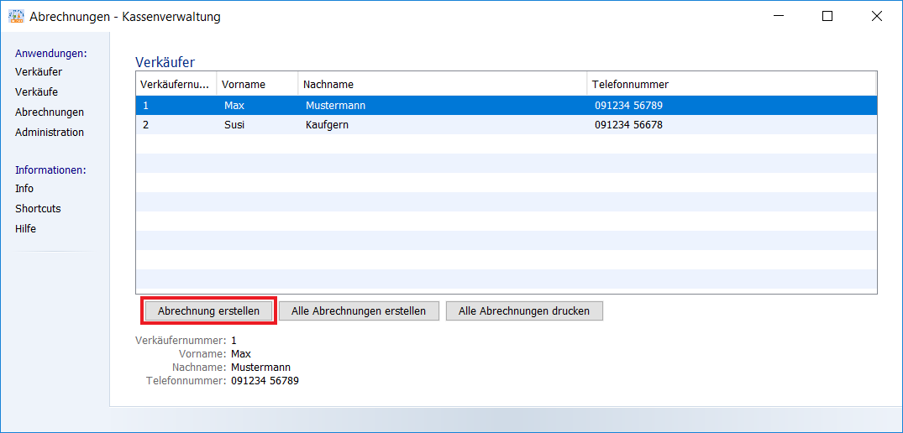

Nachdem Klick öffnet sich ein Dialog. Hier ist der Dateipfad beschrieben wo das Dokument gespeichert wurde.
Auf dem Desktop wird ein Ordner namens "Basar Abrechnungen" erstellt. Hier befindet sich dann für jeden Verkäufer
jeweils eine PDF und eine Excel Datei mit einer Übersicht seiner verkauften Artikel.

###Alle Abrechnungen drucken

Um alle Abrechnungen zu drucken, benötigt es einen Klick auf „Alle Abrechnungen drucken“.
Nach dem Klick öffnet sich ein Fenster, hier kann der Drucker ausgewählt werden.

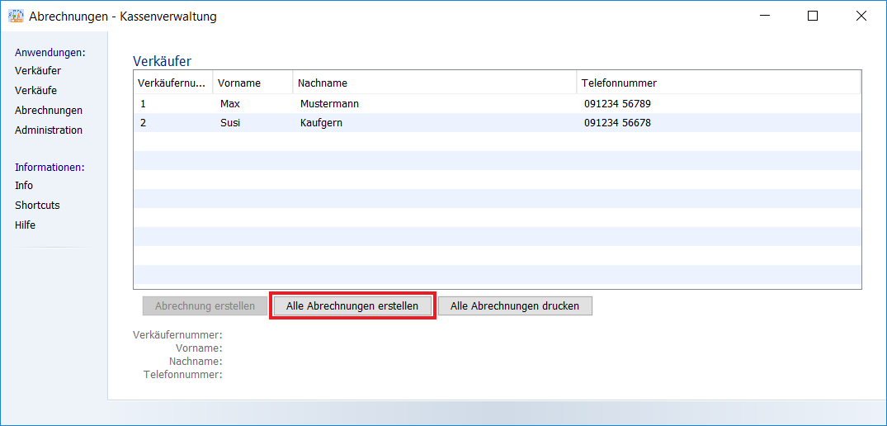

Außerdem werden wie oben bei "Abrechnung drucken" beschrieben, für jeden Verkäufer automatisch 
eine PDF und eine Excel Datei mit einer Übersicht seiner verkauften Artikel angelegt und im Ordner gespeichert.

###Interne Abrechnung drucken

„Interne Abrechnung drucken“ erstellt eine Übersicht von allen Verkäufen die getätigt wurden.
Hier sind Statistiken zu finden wie :

* Insgesamt verkaufte Artikel
* Insgesamter Umsatz
* Insgesamte Auszahlung
* Anteil des Kindergartens
* Einnahmen und Auszahlungsbeträge an die jeweiligen Verkäufer

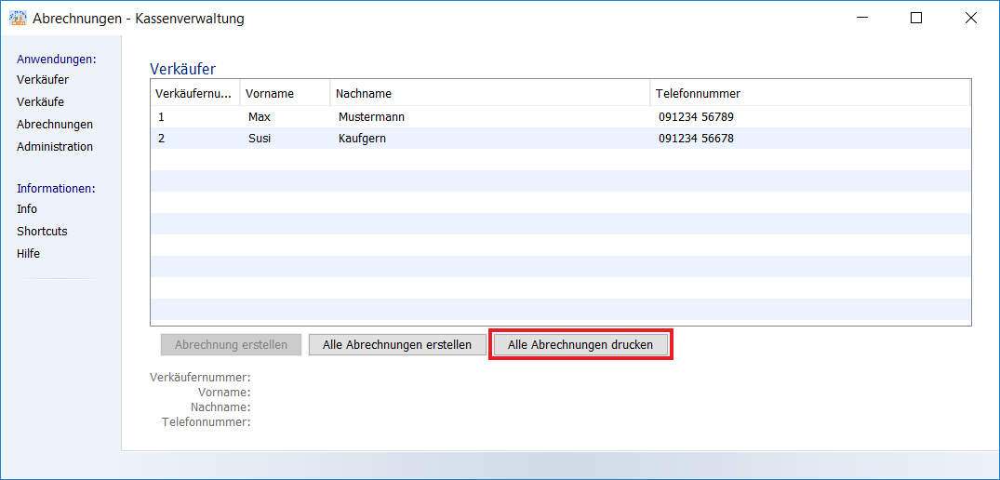

###Info

Ein Klick auf Info öffnet das Informationsfenster.

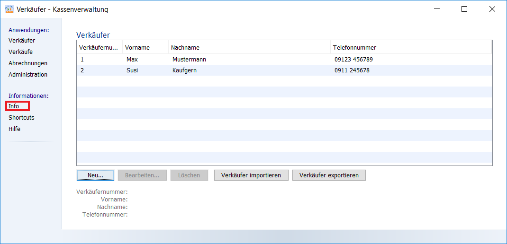

Im Infofeld befinden sich die Kontaktdaten des Ansprechpartners und zusätzlich ein Link welcher die Hilfe Datei im Browser öffnet.

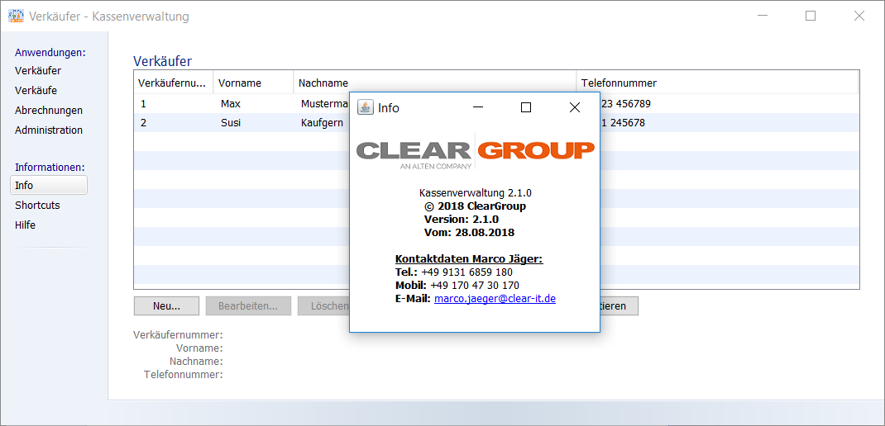

###Shortcuts

Um die Bedienung zu vereinfachen, befinden sich in der Anwendung folgende Shortcuts:

* Strg - 1 Ansicht Verkäufer
	* Wechselt in die Ansicht "Verkäufer"
* Strg - 2 Ansicht Verkäufe
	* Wechselt in die Ansicht "Verkäufe"
* Strg - 3 Ansicht Abrechnungen
	* Wechselt in die Ansicht "Abrechnungen"
* Strg - 4 Administration
    * hier kann man die Anwendung zurücksetzen
